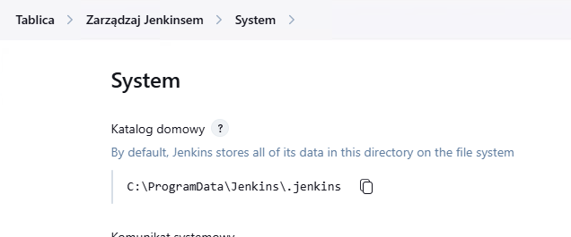
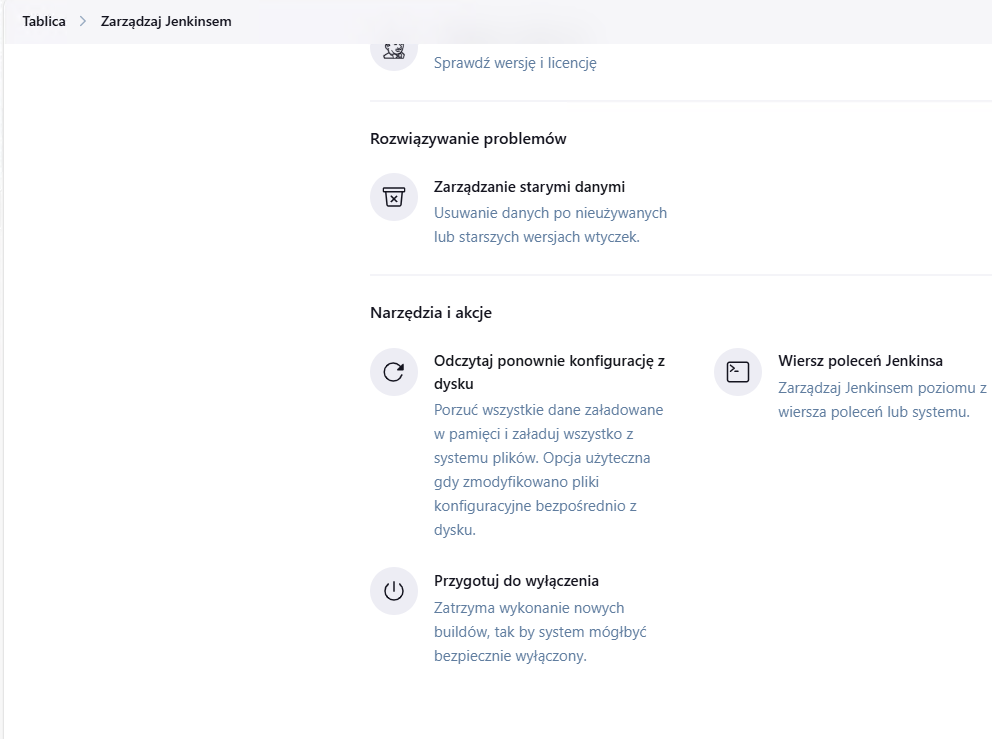
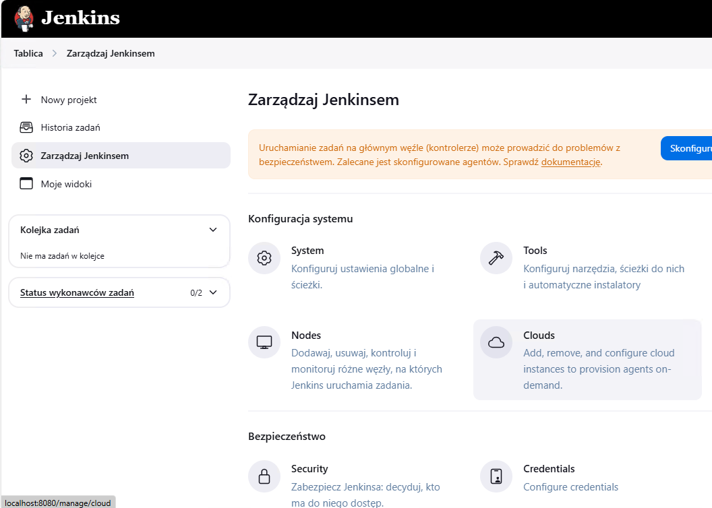
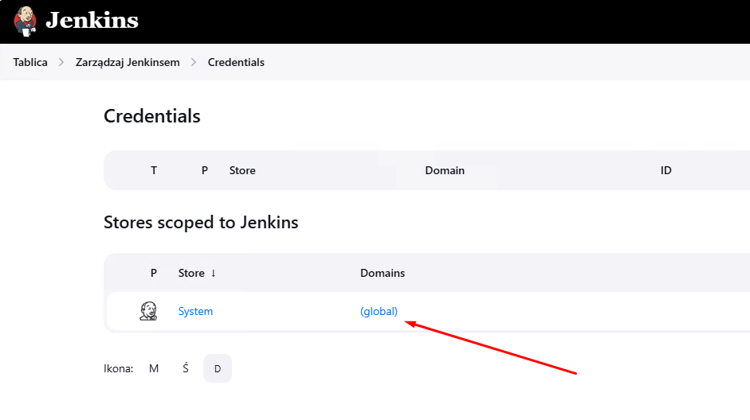
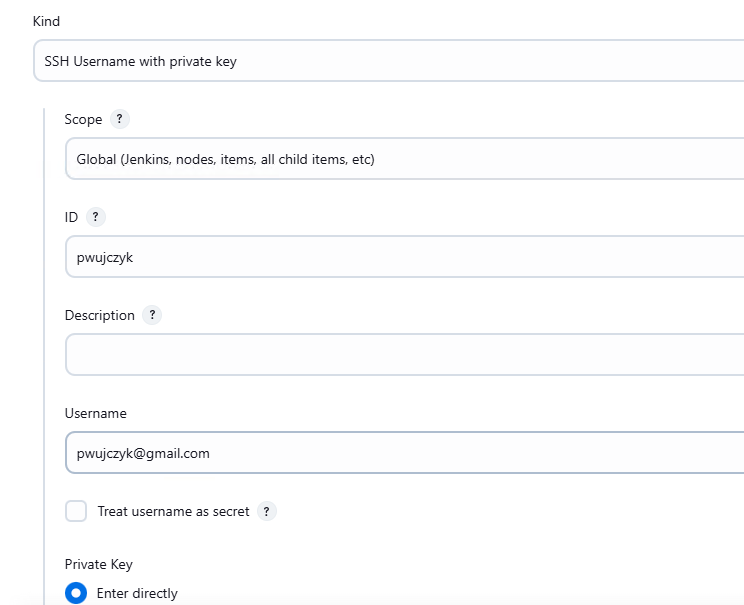
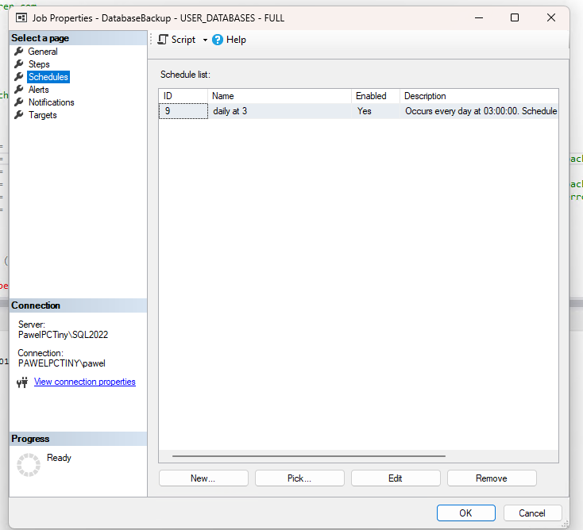
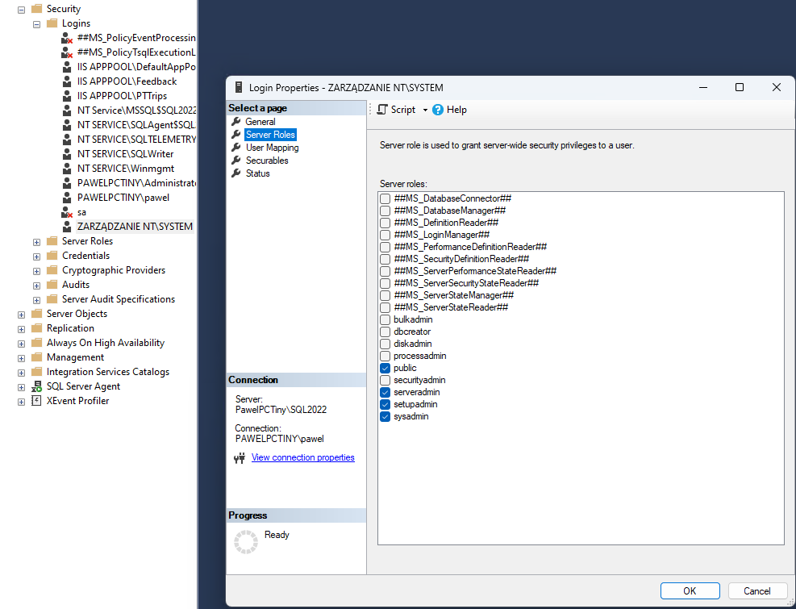

### VSCode and dotnet
```
winget install -e --id Microsoft.VisualStudioCode
winget install Microsoft.DotNet.SDK.9
winget install Microsoft.DotNet.SDK.6
```
### Git
```
winget install -e --id Git.Git
git config --global user.email pwujczyk@gmail.com
git config --global user.name "Pawel Wujczyk"
```

### Powershell
```
git clone git@github.com:Home-Repositories/Powershell.git
.\WindowsServer.ps1
instsall-module az
```

 git config --global --add safe.directory C:/ProgramData/Jenkins/.jenkins/jobs

### SQL Server
```
winget install --id=Microsoft.SQLServer.2022.Developer  -e
```
But because of the language version of the windows it did not work.

### Jenkins
- download java
- install java ```.\jdk-21_windows-x64_bin.exe /quiet```
- install jenkins 

[Jenkins Downlaod](https://www.jenkins.io/download/thank-you-downloading-windows-installer-stable/)

#### Plugins:
- msbuild

#### Jobs
Find home path of jenkins 


Clone git repository (private one)
```
 git clone git@github.com:Home-Repositories/Jenkins.git .
```

Check if in the ```ManageJobs.ps1``` file path is correctly set.
Execute 
```
.\ManageJobs.ps1 init
```


 Reload the configuration from the drive



Create credentials



Click global



SSH Username with private key




## DB Migration

```
BACKUP DATABASE PTTeamManagement
TO DISK = 'c:\backup\PTTeamManagement.bak';
```

Restore
```
RESTORE DATABASE PTTeamManagement  
FROM DISK = 'c:\backup\PTTeamManagement.bak'
with move 'PTTeamManagement' TO 'C:\Program Files\Microsoft SQL Server\MSSQL16.SQL2022\MSSQL\DATA\PTTeamManagement.mdf',
 move 'PTTeamManagement_Log' TO 'C:\Program Files\Microsoft SQL Server\MSSQL16.SQL2022\MSSQL\DATA\PTTeamManagement_log.ldf',
 REPLACE,
 STATS=10
```

Open ports in the firewall 


Hosting bundle:
HTTP Error 500.19 - IIS 7.5 Error 0x8007000d

https://dotnet.microsoft.com/en-us/download/dotnet/thank-you/runtime-aspnetcore-9.0.3-windows-hosting-bundle-installer

```
Master configuration
install-module productivitytools.masterconfiguration
Set-MasterConfiguration -Directory C:\Bin\GitHub\Home.Configuration
```
Restart

## Database backup
[Download Ola script](https://ola.hallengren.com/sql-server-backup.html)

Change the backup directory and cleanup time
The backup directory needs to exist.

```
DECLARE @BackupDirectory nvarchar(max)     = N'D:\backup'
DECLARE @CleanupTime int                   = 168 
```

Add the trigger to the **Database Backup - USER_DATABASES** Job




## [IIS APPPOOL\PTTrips] users

Jenkins files contain step that adds IIS users to the SQL. It could happen that during this step "Permission denied" is returned.

To fix that, check under what user pipeline is executed (it is in the log of the pipeline)
```
C:\ProgramData\Jenkins\.jenkins\workspace\PTTrips.Api>whoami
zarz�dzanie nt\system
```

And add the ```Sysadmin``` role for that user

